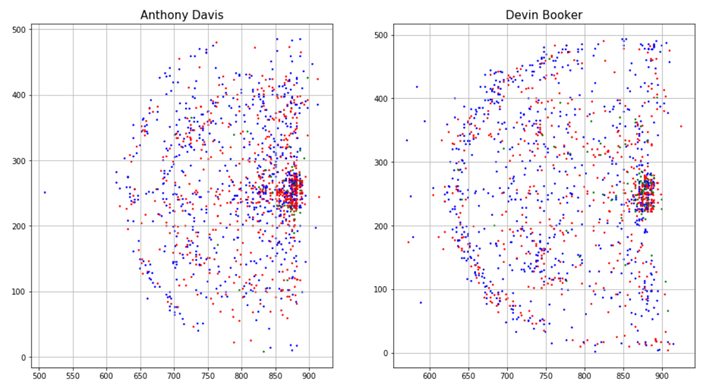

### Sports Analytics ###
*Predictor Models for various Sports Leagues*

⚽English Premier League

Pythagorean Predictor indicated the top 5 EPL teams for first and second half of season 2017-2018

| 1st half    | Predictor % | 2nd half    | Predictor % |
| ----------- | ----------- | ----------- | ----------- |
| | 96%         || 90%         |   
|| 89%         || 87%         |
| | 88%         || 83%         |
| | 80%         || 81%         |
| | 79%         || 67%         |

🏀National Basketball Association

Heatmap review of Anothony Davis and Devin Booker (2016-2017 season)

2pt Field goal attempts & 3pt shot attempts:
Made🔴
Missed🔵
Blocked🟢

 

🏒National Hockey League

Trend review for NHL seasons 2009-2020

- Highest win % in regular season only once was correlated with a Stanley Cup Champion *2013 Chicago Blackhawks*, however twice was correlated with a Stanley Cup Final runner up *2011 Vancouver Canucks and 2019 Boston Bruins*
- Largest team salaries only once was correlated with a Stanley Cup Champion *2018 Washington Capitals*
- The New York Rangers have had 3 seasons with the highest team salary in this timespan
- Chicago and Pittsburgh each have 3 Championships, while Boston found themselves runner up twice

|Season| Stanley Cup Champion | Highest Win % | Highest 💰 Salary | Runner Up |
|----  | ---------------------| ------------- | ----------------- | ----------|
|2009  |||||
|2010  |||||
|2011  |||||
|2012  |||||
|2013  |||||
|2014  |||||
|2015  |||||
|2016  |||||
|2017  |||||
|2018  |||||
|2019  |||||
|2020  |||||
|2021  ||||
|2022  |  ||| |
|2023  |  |  | | 
|2024  | TBD  | |WPG | TBD

 

⚾Major League Baseball

2018 Stadium Homerun Review
 
Yankee Stadium🔵
Fenway Park🔴

Dodger Stadium🔵
Fenway Park 🔴

